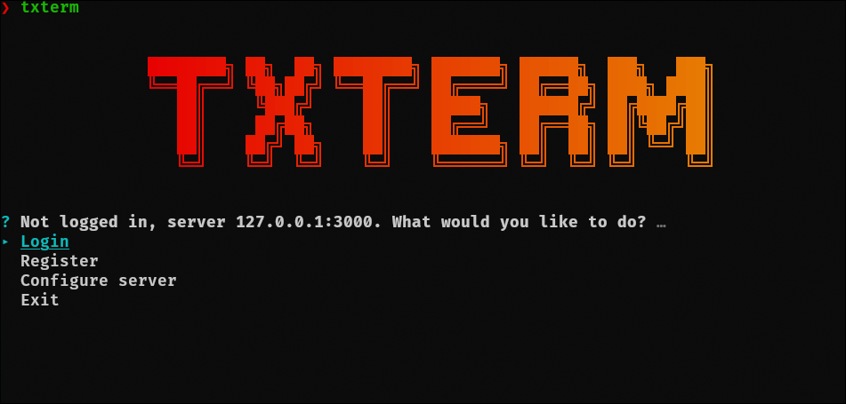
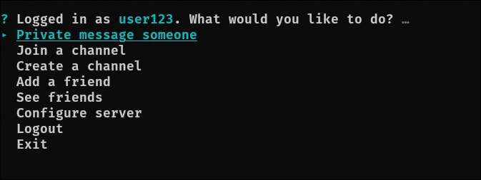
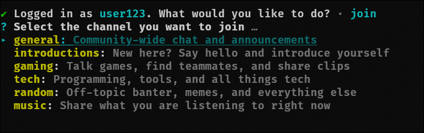
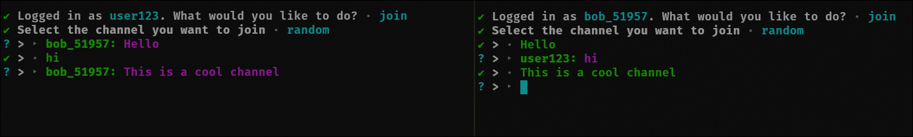

# txterm
txterm is a lightweight, CLI-based IRC-style chat system built using Node.js and SocketCluster. It features a simple terminal interface and supports real-time communication over WebSockets. Users can join channels, send broadcast and private messages all from the command line. The system showcases a modular client-server architecture using publish/subscribe patterns, with support for multi-channel communication, event-based messaging, and a reactive design inspired by classic IRC clients.

## Screenshots

Launch txterm to land on the welcome screen and login menu:

<p align="center">
  
</p>

Once logged in, an interactive menu gives you access to everything:

<p align="center">
  
</p>

Browse and join public channels:

<p align="center">
  
</p>

Chat in real time, with messages delivered instantly over WebSockets:

<p align="center">
  
</p>

## Commands

- `-V, --version`  
  Output the version number of `txterm`.

- `-l, --login`  
  Log in to `txterm`.

- `-r, --register`  
  Register a new account with `txterm`.

- `-c, --chat <recipient>`  
  Send a private message to a specified recipient.

- `-j, --join`  
  Join a channel.

- `-C, --create`  
  Create a new channel.

- `-a, --add <username>`  
  Add a new friend.

- `-h, --help`  
  Display help information for available commands.

## Installation

To set up `txterm-server`, follow these steps:

1. **Clone the repository:**

   ```sh
   git clone https://github.com/Rudra-241/txterm.git
   ```
2. **Navigate to the server directory**
   ```sh
   cd txterm/server
   ```
3. **Start the server**
   (make sure you have mongodb installed)
   ```sh
   npm install
   npm start
   ```
For txterm-client:

1. **Navigate to client directory**
   ```sh
   cd txterm/client
   ```
2. **Install dependencies**
   ```sh
   npm install
   ```
3. **Link the txterm.js file**
   (might require root privelleges)
   ```sh
   npm link
   ```
4. **Run txterm**
   ```sh
   txterm --help
   ```
